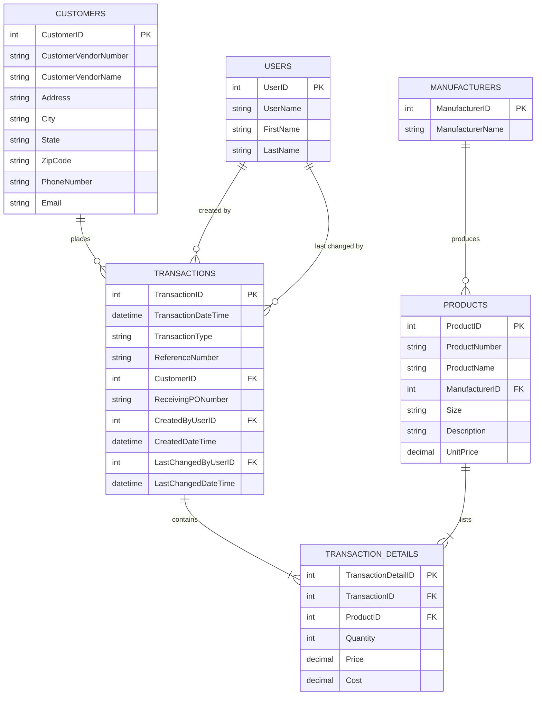

```mermaid
erDiagram
    CUSTOMERS ||--o{ TRANSACTIONS : "places"
    TRANSACTIONS ||--|{ TRANSACTION_DETAILS : "contains"
    PRODUCTS ||--|{ TRANSACTION_DETAILS : "lists"
    MANUFACTURERS ||--o{ PRODUCTS : "produces"
    USERS ||--o{ TRANSACTIONS : "created by"
    USERS ||--o{ TRANSACTIONS : "last changed by"

    CUSTOMERS {
        int CustomerID PK
        string CustomerVendorNumber
        string CustomerVendorName
        string Address
        string City
        string State
        string ZipCode
        string PhoneNumber
        string Email
    }

    PRODUCTS {
        int ProductID PK
        string ProductNumber
        string ProductName
        int ManufacturerID FK
        string Size
        string Description
        decimal UnitPrice
    }

    MANUFACTURERS {
        int ManufacturerID PK
        string ManufacturerName
    }

    TRANSACTIONS {
        int TransactionID PK
        datetime TransactionDateTime
        string TransactionType
        string ReferenceNumber
        int CustomerID FK
        string ReceivingPONumber
        int CreatedByUserID FK
        datetime CreatedDateTime
        int LastChangedByUserID FK
        datetime LastChangedDateTime
    }

    TRANSACTION_DETAILS {
        int TransactionDetailID PK
        int TransactionID FK
        int ProductID FK
        int Quantity
        decimal Price
        decimal Cost
    }

    USERS {
        int UserID PK
        string UserName
        string FirstName
        string LastName
    }
```